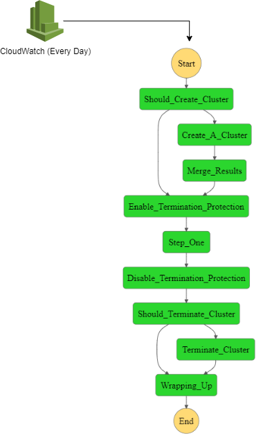

# ETL Job - Spark & Step Functions
To preprocess the raw data from s3, we will be using EMR as our computer resource and AWS Step Functions as our orchestrator. The pipeline is triggered daily through a Cloud Watch event.

## Let's Begin!

## Workflow

The state machine's workflow that will be building is the following:


## Input
The first step of our pipeline is to create our EMR cluster. This script offers the possibility of using an already created cluster. Therefore, the input JSON for the pipeline is:
```json
{
    "CreateCluster": true,
    "TerminateCluster": true
}
```

If you want to use an already created cluster, you must pass the Cluster-Id to the pipeline, for example:

```json
{
    "CreateCluster": false,
    "TerminateCluster": false,
    "ClusterId": {YOUR_CLUSTER_ID}
}```

## Create Cluster
In this state, we will:
- **Configure the cluster's hardware**: type and number of instances,
- **IAM Permissions**
- **Subnet Configurations**
- **Enable Termination Protection**: Since the ETL pipeline may take many hours, we should Enable Termination to protect the workflow against an accidental EMR termination.
```json
"Should_Create_Cluster": {
      "Type": "Choice",
      "Choices": [
        {
          "Variable": "$.CreateCluster",
          "BooleanEquals": true,
          "Next": "Create_A_Cluster"
        },
        {
          "Variable": "$.CreateCluster",
          "BooleanEquals": false,
          "Next": "Enable_Termination_Protection"
        }
      ],
      "Default": "Create_A_Cluster"
    },
    "Create_A_Cluster": {
      "Type": "Task",
      "Resource": "arn:aws:states:::elasticmapreduce:createCluster.sync",
      "Parameters": {
        "Name": "{YOUR CLUSTER NAME}",
        "VisibleToAllUsers": true,
        "ReleaseLabel": "emr-6.2.0",
        "Applications": [
          {
            "Name": "spark"
          },
          {
            "Name": "Hive"
          }
        ],
        "Configurations": [
          {
            "Classification": "spark",
            "Properties": {
              "maximizeResourceAllocation": "true"
            }
          }
        ],
        "ServiceRole": "EMR_DefaultRole",
        "JobFlowRole": "ec2_defaultrole",
        "LogUri": "{S3-BUCKET-FOR-LOGGING}",
        "Instances": {
          "Ec2SubnetId": "{YOUR_SUBNET}",
          "KeepJobFlowAliveWhenNoSteps": true,
          "InstanceFleets": [
            {
              "InstanceFleetType": "MASTER",
              "TargetOnDemandCapacity": 1,
              "InstanceTypeConfigs": [
                {
                  "InstanceType": "m5.2xlarge"
                }
              ]
            },
            {
              "InstanceFleetType": "CORE",
              "TargetOnDemandCapacity": 1,
              "InstanceTypeConfigs": [
                {
                  "InstanceType": "c5.4xlarge"
                }
              ]
            },
            {
              "InstanceFleetType": "TASK",
              "TargetSpotCapacity": 4,
              "InstanceTypeConfigs": [
                {
                  "InstanceType": "c5.12xlarge"
                }
              ]
            }
          ]
        }
      },
      "ResultPath": "$.CreateClusterResult",
      "Next": "Merge_Results"
    },
    "Merge_Results": {
      "Type": "Pass",
      "Parameters": {
        "CreateCluster.$": "$.CreateCluster",
        "TerminateCluster.$": "$.TerminateCluster",
        "ClusterId.$": "$.CreateClusterResult.ClusterId"
      },
      "Next": "Enable_Termination_Protection"
    },
    "Enable_Termination_Protection": {
      "Type": "Task",
      "Resource": "arn:aws:states:::elasticmapreduce:setClusterTerminationProtection",
      "Parameters": {
        "ClusterId.$": "$.ClusterId",
        "TerminationProtected": true
      },
      "ResultPath": null,
      "Next": "Step_One"
    },
```

## Add Spark Step
There are two different ways of running a script using an EMR Step:
- `command-runner.jar`:  run commands on your cluster, and you specify command-runner.jar without using its entire path.
- `script-runner.jar`: Hosted on Amazon S3 at s3://<region>.elasticmapreduce/libs/script-runner/script-runner.jar where <region> is the Region in which your Amazon EMR cluster resides. You can use it to run scripts saved locally or on Amazon S3 on your cluster.

For more information, go to [Amazon EMR Documentation](https://docs.aws.amazon.com/emr/latest/ReleaseGuide/emr-commandrunner.html).

In this tutorial, we have preferred to use a bash script for running our spark-submit.

```json
"Step_One": {
      "Type": "Task",
      "Resource": "arn:aws:states:::elasticmapreduce:addStep.sync",
      "Parameters": {
        "ClusterId.$": "$.ClusterId",
        "Step": {
          "Name": "The first step",
          "ActionOnFailure": "CONTINUE",
          "HadoopJarStep": {
            "Jar": "s3://us-west-1.elasticmapreduce/libs/script-runner/script-runner.jar",
            "Args": [
              "s3://{PATH_TO_YOUR_BASH_SCRIPT}"
            ]
          }
        }
      },
      "Catch": [
        {
          "ErrorEquals": [
            "States.TaskFailed"
          ],
          "ResultPath": "$.err_mgs_17",
          "Next": "Disable_Termination_Protection"
        }
      ],
      "ResultPath": null,
      "Next": "Disable_Termination_Protection"
```

Our bash script:

```bash
#!/bin/sh

aws s3 cp s3://{YOUR_BUCKET}/preprocessing_script/ ./ --recursive

spark-submit --master yarn --deploy-mode cluster preprocessing.py
```

The preprocessing.py file corresponds to your ETL python script.

## Terminate Cluster
First, we have to disable the Termination Protection, and then we can terminate it.

```json
"Should_Terminate_Cluster": {
      "Type": "Choice",
      "Choices": [
        {
          "Variable": "$.TerminateCluster",
          "BooleanEquals": true,
          "Next": "Terminate_Cluster"
        },
        {
          "Variable": "$.TerminateCluster",
          "BooleanEquals": false,
          "Next": "Wrapping_Up"
        }
      ],
      "Default": "Wrapping_Up"
    },
    "Terminate_Cluster": {
      "Type": "Task",
      "Resource": "arn:aws:states:::elasticmapreduce:terminateCluster.sync",
      "Parameters": {
        "ClusterId.$": "$.ClusterId"
      },
      "Next": "Wrapping_Up"
    },
    "Wrapping_Up": {
      "Type": "Pass",
      "End": true
    }

```
